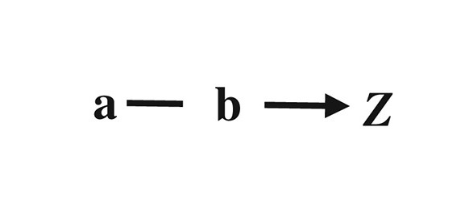
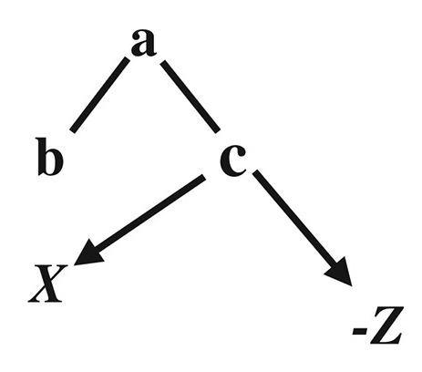
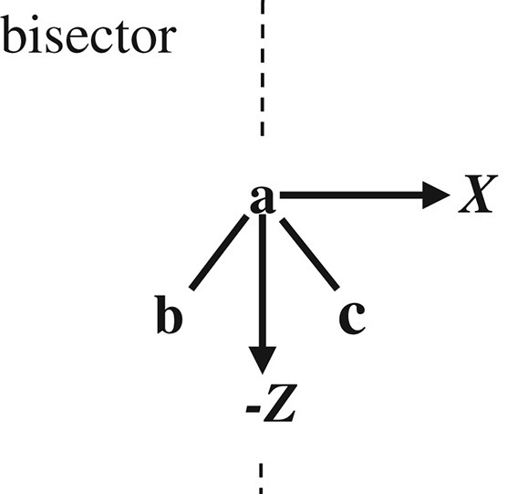
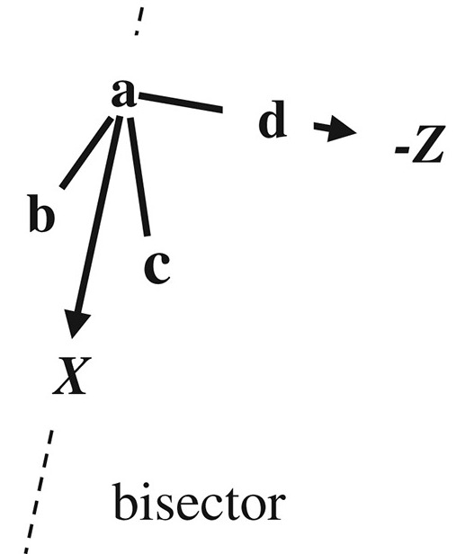
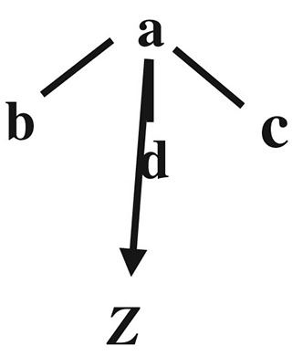

# SULLEY 🚪 ⚡

<p align='center'>

</p>

**SULLEY** stands for **Symmetry Understanding of Local Frames for Learning Equivariant geometrY**. This project focuses on developing a framework to find local frames for each atom in a molecule, allowing for the accurate description of their electrostatic multipoles.

It uses the same methodology as [Poltype](https://github.com/TinkerTools/poltype2) and [Tinker](https://github.com/TinkerTools/tinker-hp).

## Table of content

- [Objective](#objective)
- [Methodology](#methodology)
- [Key Features](#key-features)
- [Applications](#applications)
- [Installation](#installation)
- [Using Sulley](#using-sulley)
- [Understand the output](#understand-the-output)
- [Project Status](#project-status)

## Objective

The primary goal of SULLEY is to identify the local frames of each atom, facilitating the description of their multipole characteristics. By leveraging these local frames, the project aims to enhance the learning of multipoles in an equivariant manner.

## Methodology

SULLEY draws inspiration from existing methodologies, particularly the [Poltype](https://github.com/TinkerTools/poltype2) framework, utilizing a possibility tree approach to model the local frames effectively. This will enable a structured exploration of atomic environments and their interactions.

## Key Features

- **Equivariant Learning**: The local frames will be used to train neural networks in a way that respects the symmetries of the molecular system.
- **Efficiency**: By optimizing the representation of local frames, SULLEY aims to create a much faster neural network for learning multipoles, significantly improving computational performance.

## Applications

SULLEY's approach is intended for applications in fields such as computational chemistry and molecular dynamics, where understanding electrostatic interactions at the atomic level is crucial.

## Installation

To install SULLEY:

1. Clone current repository

   ```bash
   git clone git@github.com:comecattin/SULLEY.git .
   ```

2. Navigate to the cloned repository

   ```bash
   cd SULLEY
   ```

3. Install application

   ```bash
   pip install -e .
   ```

## Using Sulley

To generate local frames for a molecule, use the following arguments:

### Arguments

- `--smiles` : The molecule SMILES to generate the local frame for.
- `--sdf` : The molecule SDF file to generate the local frame for.
- `--xyz` : The molecule Tinker XYZ file to generate the local frame for. Multiple molecules can be given in the same XYZ file.
- `-o`, `--output` : The file to write the local frame to. Default is `local_frame.txt`.
- `--use-ecfp` : Use the ECFP (Extended Connectivity FingerPrint) algorithm instead of the original one for faster symmetry class computation.
- `--radius` : If the ECFP option is on, the ECFP radius. The default is `3`.
- `-v`, `--verbose` : Print the local frame to the console.
- `--debug` : Print debug information. Compare to the Poltype local frame.
- `-h`, `--help`: Display the CLI help.

### Examples

1. Generate a local frame from a SMILES and write it to the default file:

    ```bash
    sulley --smiles "CCO"
    ```

2. Generate a local frame from an SDF file and specify an output file:

    ```bash
    sulley --sdf molecule.sdf -o output_frame.txt
    ```

### Understand the output

SULLEY output a `.txt` file that contain the description of the local frame for each atom. Five different local frame type are detected as in Tinker (see [this paper 🗞️](https://doi.org/10.1002/jcc.26954)).

1. **Z-only local frame** <p></p>

2. **Z-then-X local frame** <p></p>
3. **Bisector local frame** <p></p>
4. **Z-then-bisector local frame**<p></p>
5. **Trisector local frame**<p></p>

The first colum of each line correspond to the central atom index.

If the line ends with a `0`:

- Then it is a Z-only local frame and the second colum is the atom index defining the z-axis.

If there is only 3 columns:

- If the last two columns are negative then it corresponds to a bisector local frame and the two last columns are atom index defining the bisector.
- Otherwise, it define a Z-then-X local frame. The fist column is the atom index defining the z-axis and the second is the atom index defining the x-axis.

Otherwise (4 columns):

- If all the last 3 column are negative then it defines a trisector local frame. The 3 atom index define the 3 vector of the trisector.
- Else it defines a Z-then-bisector local frame. The second column (positive) is the atom index defining the z-axis. The two last column (negative) are the atom index defining the bisector.

### Computing the rotation matrix

It is possible to compute the rotation matrix from the topology and coordinates by using the `sulley` API as follows:

   ```python
   from sulley.extract_neighbors import load_molecule_from_tinker_xyz
   from sulley.local_frame import generate_local_frame

   xyz = 'PATH_TO_XYZ_FILE'
   mol = load_molecule_from_tinker_xyz(xyz)
   local_frame = generate_local_frame(mol=mol, filename='local_frame.txt')
   positions = mol.GetConformer().GetPositions() # Or any np.array representing positions
   rot_mat = compute_rotation_matrix(local_frame, positions)
   ```

## Project Status

The project is currently under development and ongoing research. Contributions and suggestions are welcome!
